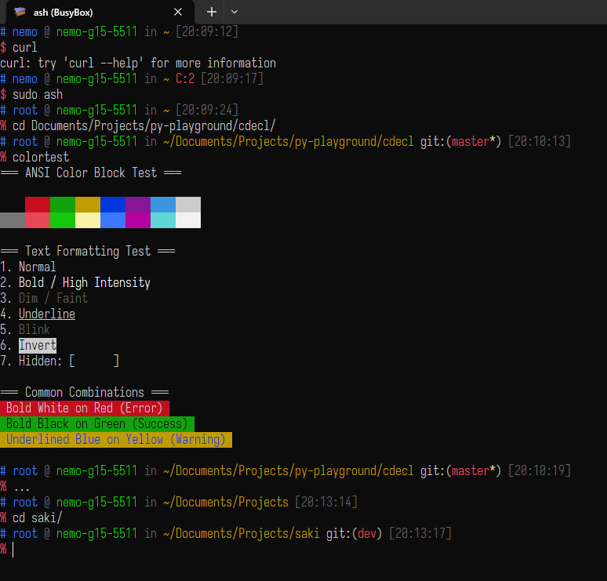

# dotfiles
Nemo's dotfiles

## BusyBox (busybox-w32) ash (`.ashrc`)

```
BusyBox v1.38.0-FRP-5857-g3681e397f (2025-10-10 08:26:06 UTC)
(mingw64-gcc 14.2.1-4.fc42; mingw64-crt 12.0.0-5.fc42; glob)
```

Set `ENV` to `.ashrc` in your account/user envionment variables, then copy this file to ~/.ashrc.

